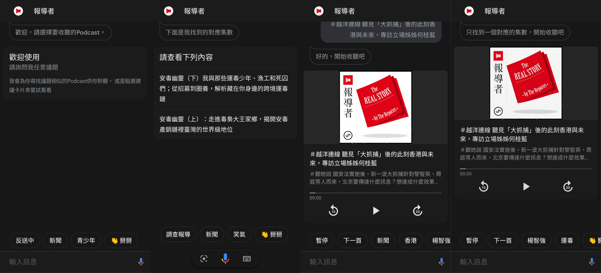

# google-assistant
Twreporter Google Assistant App
 
#內容架構更改  
轉變運作模式轉為:  

串接由報導者推出的Podcast之RSS，  
支援使用者以輸入內容搜尋議題相近的集數播放  

-- agent.zip :上傳至Dialogflow可直接複寫原始架構，轉為新的設定  
-- function資料夾 :  依據RSS架構重新編寫設計的Fulfillment    
   目前儲存RSS所需資訊之後台是Firebase，視需求需要更改這部份的設計~

增加針對智慧音箱(Google Home)的對話流程   

  
  
執行原理
-------

* Google助理：
  - 為Google開發的智慧型個人助理
  - 在第三方應用的角色是處理語音辨識及傳遞回應給使用者
* DialogFlow：
  - 建構自然語言處理模型並訓練機器辨識使用者輸入的意圖(Intent)
  - 並作為中介把資訊傳遞給Fulfillment
* Fulfillment：
  - 將來自DialogFlow的資訊進行分析再回應給使用者
  - 實作上是將Fulfillment部署到Google Cloud Functions上，作為處理與回傳客製化回應的中介

[官方說明頁面](https://developers.google.com/assistant/conversational/df-asdk/overview)
